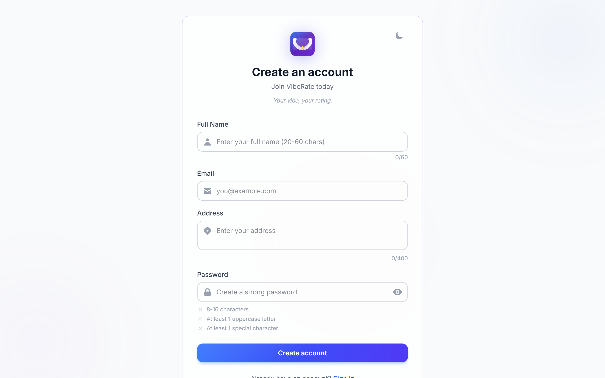
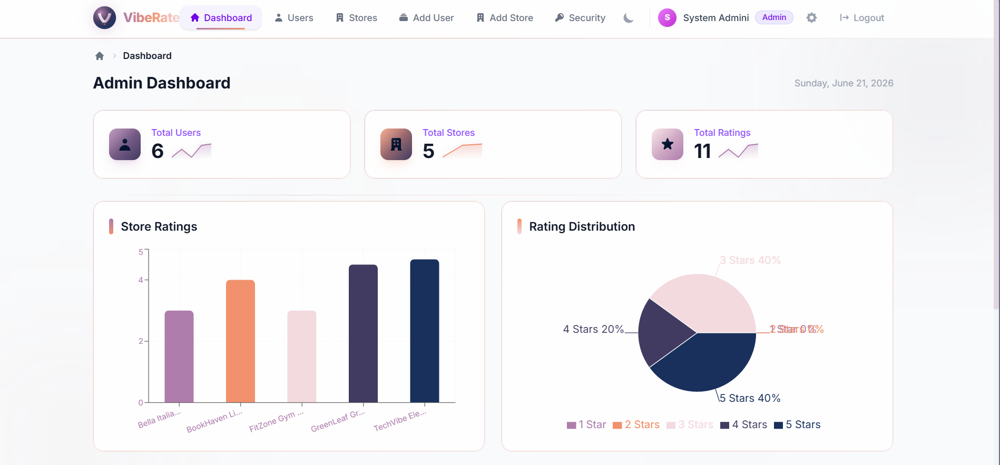

# Store Rating Platform

A full-stack store rating web application built with **Express.js**, **PostgreSQL**, and **React (Vite)** with three user roles: **admin**, **user**, and **store_owner**.

## Features

- Role-based JWT authentication (admin, user, store_owner)
- Full CRUD for users, stores, and ratings
- Admin dashboard with analytics charts (Recharts)
- Search, filter, sort, and pagination on all tables
- Interactive star rating with confetti
- CSV export, undo delete toasts
- Dark mode, responsive design (mobile/tablet/desktop)
- Docker support, GitHub Actions CI

## Screenshots

| Admin Dashboard | Login Page |
|:---:|:---:|
|  |  |

| Admin Users | Admin Stores |
|:---:|:---:|
|  |  |

| User Stores | Signup |
|:---:|:---:|
|  |  |

| Mobile Login | Mobile Dashboard |
|:---:|:---:|
|  |  |

| Dark Mode - Login | Dark Mode - Dashboard |
|:---:|:---:|
|  |  |

| Light Mode - Dashboard |
|:---:|
|  |

## Tech Stack

| Layer | Technology |
|-------|-----------|
| Backend | Express.js, PostgreSQL, JWT, express-rate-limit |
| Frontend | React (Vite), TailwindCSS v4, Recharts, react-hot-toast |
| Database | PostgreSQL |
| DevOps | Render, Docker, Docker Compose, GitHub Actions |

## Quick Start

```bash
# Backend
cd backend
npm install
npm start          # Runs on port 5000

# Frontend
cd frontend
npm install
npm run dev        # Runs on port 3000, proxies /api to backend
```

For local development, PostgreSQL must be running. The database schema auto-initializes on first start. Seed with `cd backend && npm run db:seed`.

## Default Accounts

| Role | Email | Password |
|------|-------|----------|
| Admin | admin@test.com | Admin@123 |
| User | test@example.com | User@123 |
| Owner | owner@test.com | Owner@123 |

## API Routes

### Public
- `POST /api/auth/signup` — Register
- `POST /api/auth/login` — Login

### User
- `GET /api/auth/me` — Get profile
- `PUT /api/auth/profile` — Update own profile
- `PUT /api/auth/password` — Change password
- `GET /api/stores` — List stores
- `GET /api/stores/:id` — Store details
- `POST /api/stores/:id/rate` — Submit rating

### Store Owner
- `GET /api/dashboard/owner` — Owner stats & store
- `PUT /api/dashboard/owner/store` — Edit own store

### Admin
- `GET /api/admin/dashboard` — Platform stats
- CRUD `/api/admin/users`, `/api/admin/stores`
- `DELETE /api/admin/ratings/:id`
- `PUT /api/admin/users/:id/password`

## Docker

```bash
docker-compose up --build
```

Backend on port 5000, Frontend served via nginx on port 80.
